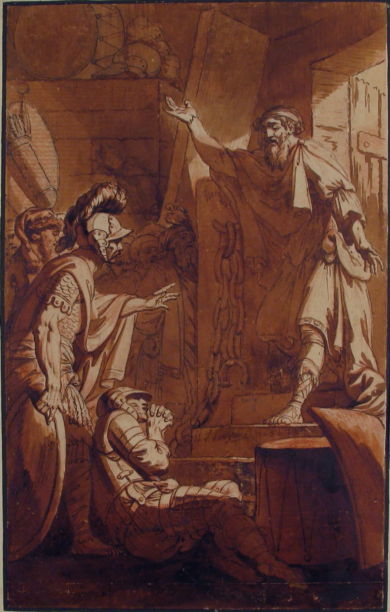

# `doorman` 🚪
🚪 Doorman 🚪

Is a cli application to help with managing and getting secrets.

## Exchange Methods
There are many ways to exchange internally in a system but not all are secure. It is an option to print out the
secrets that `doorman` receives from one of the *clerks* (the name of the plugins for `doorman`). It can be pass
securely by piping it to another terminal application.

But there might be situations where this option is the least secure one. Also, *clerks* need to be able to exchange with
`doorman` in a secure way. So for those reasons three methods are available:

- 🪟 [Named Pipes](https://learn.microsoft.com/en-us/windows/win32/ipc/named-pipes) - Only for Windows
- 🔌 [Unix Domain Sockets](https://man7.org/linux/man-pages/man7/unix.7.html) - Available for Mac OS X 🍎 and Linux 🐧
- 🚌 [D-Bus](https://www.freedesktop.org/wiki/Software/dbus/) - Only for Linux 🐧

Each of these methods have their advantages and disadvantages.

> [!NOTE]
> - 🪟 [Named Pipes](https://learn.microsoft.com/en-us/windows/win32/ipc/named-pipes) is the only secure way to exchange
> that is supported on Windows.
> - 🔌 [Unix Domain Sockets](https://man7.org/linux/man-pages/man7/unix.7.html) is the only secure option for Mac OS X
> outside of piping.

### Security comparison

| Threat Model	                         | 🚌 D-Bus	                                | 🔌 Unix Domain Sockets                 |
|---------------------------------------|------------------------------------------|----------------------------------------|
| Prevent unauthorized access	          | ✅ Built-in access policies	              | ✅ File permissions (chmod)             |
| Prevent privilege escalation	         | ✅ Restricted to specific users/apps	     | ✅ Restricted by filesystem permissions |
| Prevent data interception	            | ✅ Encrypted if configured	               | 🚫 No encryption (local IPC only)      |
| Prevent unauthorized service control	 | ✅ Supports fine-grained authentication	  | 🚫 No built-in authentication          |

## ©️ Copyright
- "<a rel="noopener noreferrer" href="https://commons.wikimedia.org/w/index.php?curid=60848936">File:Messenger at the Door of a Guardhouse MET 1985.112.3.jpg</a>" by <a rel="noopener noreferrer" href="https://commons.wikimedia.org/w/index.php?title=Creator:Philippe_Louis_Parizeau&action=edit&redlink=1">Creator:Philippe Louis Parizeau</a> is marked with <a rel="noopener noreferrer" href="http://creativecommons.org/publicdomain/zero/1.0/deed.en?ref=openverse">CC0 1.0 </a>.

## :scroll: License

The license for the code and documentation can be found in the [LICENSE](./LICENSE) file.

---

Made in Québec 🏴󠁣󠁡󠁱󠁣󠁿, Canada 🇨🇦!
